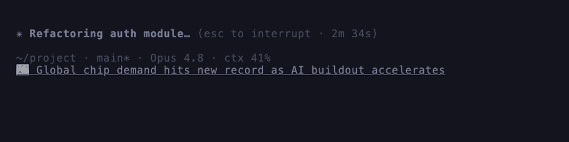

<div align="center">

**English** · [한국어](readme/ko.md) · [日本語](readme/ja.md) · [Español](readme/es.md) · [Français](readme/fr.md) · [Deutsch](readme/de.md) · [Português](readme/pt.md) · [中文](readme/zh.md)

</div>

# newsline

**Waiting for Claude Code to finish? Read the latest one-line news right in your status line.**
A rotating regional headline sits at the bottom of your session — so a long wait turns into a
quick news check. It shows *below* your existing status line (your HUD stays).

<p align="center"></p>

## Install & run — one line

```sh
# curl (macOS / Linux / WSL) — installs and sets up right away
curl -fsSL https://raw.githubusercontent.com/itdar/newsline/master/install.sh | sh

# Homebrew
brew install itdar/tap/newsline && newsline init

# npm
npm i -g newsline-cli && newsline init
```

The news line appears on your **next message** — no restart. Setup asks for a language & topic
and keeps your existing status line.

## What it does

- **Your machine fetches and shows the news** — it never touches your code, prompts, files, or
  Claude conversations.
- A small **edge service** picks the best regional sources and routes headline clicks, so sources
  stay fresh without reinstalling. If it's unreachable, newsline **falls back to built-in feeds**.
- The status line is instant (served from a cache); refreshes run in the background.

## Privacy

Everything that runs on your machine is in this repo — and this is the complete list of
what ever leaves it:

- **Feed curation** (at most once per hour): `lang`, coarse country, local time, day of
  week, timezone offset, `topic`, and the plugin version go to the edge service so it can
  pick fresh regional sources. No tracking ID, no personal data.
- **Headline clicks**: links open through a small redirect (it sees the article URL plus
  `lang`/`topic`/version), so dead sources can be swapped server-side and clicks counted
  in aggregate. There is no per-user identifier.
- **Never sent, never read**: your code, prompts, files, or Claude conversations. The
  status line renders from a local cache and never blocks on the network.

**Fully local mode**: set `"api": "off"` and `"endpoint": "off"` in
`~/.config/newsline/config.json` — feeds come from the bundled `feeds.json` and headlines
link straight to the articles. Nothing is contacted except the news feeds themselves.

## Configure

Re-run `newsline init`, or edit `~/.config/newsline/config.json`:

| Key | Default | Meaning |
|---|---|---|
| `lang` | `auto` | `ko` `ja` `en` `es` `fr` `de` `pt` `zh`, or `auto` |
| `topic` | `general` | `general` `tech` `business` `world` `sports` `science` `health` `entertainment` |
| `rotate` | `6` | seconds per headline |
| `count` | `15` | headlines in rotation |
| `maxlen` | `120` | max characters (`max` = no cut) |
| `icon` | `📰` | leading glyph (`none` to hide) |

## Uninstall

```sh
newsline uninstall      # restores your previous status line
```

Needs `bash` + `python3` (macOS / Linux; Windows via WSL).
